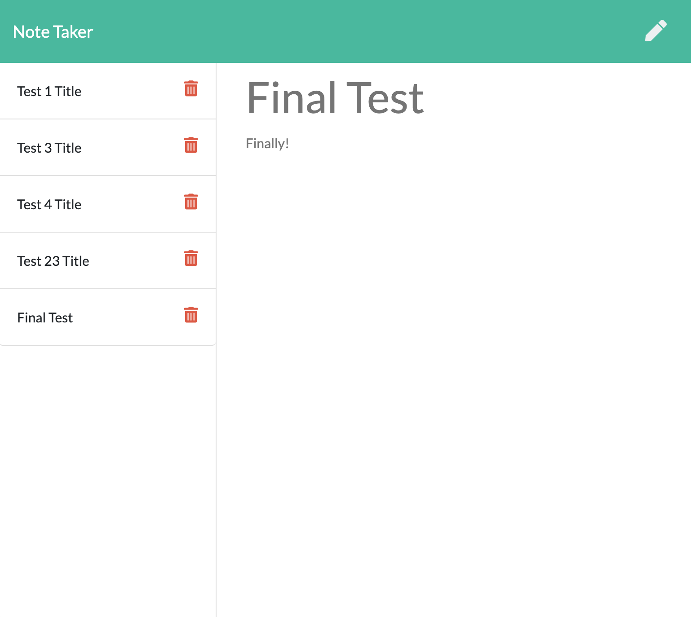

# SMU-Homework-11-Note-Taker

PUT PROJECT DESCRIPTION HERE

## Installation

### To download your own copy

Download the repo, run `npm i` and then `node server.js`.

### To just use it without downloading

[Note Taker app on Heroku](https://smu-homework-11-note-taker.herokuapp.com)

## Usage

## Credits

- Musical Soundtrack: [Summer Music Mix 2020 #4 by Eric Clapman](https://www.youtube.com/watch?v=cwfEkoHPw-o)
- Random Number Generator: [W3Schools](https://www.w3schools.com/js/js_random.asp)
- JS Splice(): [w3schools](https://www.w3schools.com/jsref/jsref_splice.asp)

## License

